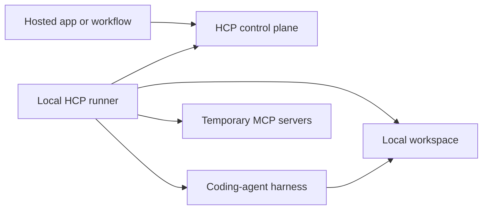
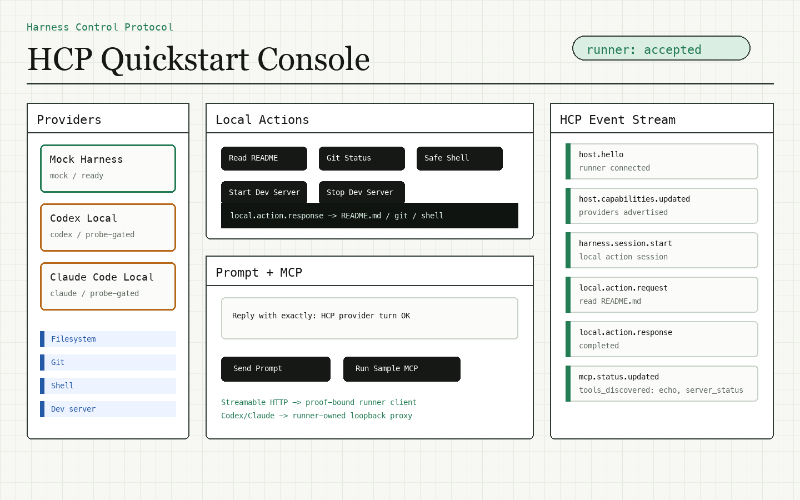

# Harness Control Protocol (HCP)

[](LICENSE)
[](https://www.typescriptlang.org/)
[](packages/hcp-protocol)

Open-source protocol and local runner for connecting hosted harnesses to local developer tools.

HCP connects hosted apps, workflow systems, and local coding-agent harnesses through an outbound WebSocket connection. The control plane can start sessions, send turns, attach short-lived MCP servers, and receive normalized runtime events without requiring inbound network access to the user's machine.

This repository contains the protocol package, runner implementation, MCP attachment layer, local capability engine, mock control plane, sample MCP server, examples, and architecture docs needed to build and test HCP integrations.

## Project Status

Harness Control Protocol is an early, pre-1.0 foundation. The protocol and runner core are implemented and covered by tests, but production harness adapters and hosted control-plane integration are still being built.

Implemented today:

- HCP v0 envelopes, message schemas, event types, local action contracts, and parser helpers.
- Public JSON Schema export, conformance fixtures, and a conformance CLI.
- Runner CLI commands for `version`, `pair`, and `run`.
- Reference pairing with single-use pairing codes, local credential storage, and short-lived connection tokens.
- Outbound WebSocket lifecycle with hello, accept/reject, heartbeat, reconnect, control-plane-owned replay cursors, and capability snapshots.
- At-least-once command handling with immediate ACK/NACK responses and durable duplicate-command idempotency.
- Atomic runner state for retained events, command receipts, and local-action receipts across process restarts.
- Complete/partial session event snapshots with explicit replacement, preservation, and tombstone semantics.
- Adapter-based session lifecycle with deterministic mock, native Codex app-server, Claude Agent SDK, and streaming OpenCode adapters. See [provider support](docs/native-providers.md) for the exact supported policies and remaining gaps.
- Local capability leases and real filesystem, Git, shell, and dev-server executors.
- MCP Streamable HTTP attachments and runner-owned named stdio profiles using the official Model Context Protocol TypeScript SDK.
- Attachment policy for allowed/denied tools, expiry checks, proof-bound requests, redaction, and close-on-session-end.
- Sample Streamable HTTP MCP server with server-side proof verification.
- Mock control plane and end-to-end example for local development and integration testing.
- Codex and Claude Code live-smoke examples that advertise real local provider readiness, validate proxied MCP setup, and run one real provider turn when local CLI config and auth are valid.
- Browser quickstart demo for local action onboarding, Codex/Claude prompt checks, and sample Streamable HTTP MCP attachment setup.

Next major work:

- Richer provider-native event normalization.
- Published packages and release automation.
- First public package release under the `@harness-control` scope.

## Why HCP Exists

Most hosted automation products need a safe way to use a developer's local environment: source code, Git state, provider credentials, local tools, and running dev servers. Opening inbound ports or copying long-lived credentials into a hosted service is a poor default.

HCP uses a local runner instead:



The runner is the local trust boundary. It advertises what is available, accepts only policy-bound commands, launches local harness sessions, attaches temporary MCP tools, and streams normalized events back to the control plane.

## Repository Layout

| Path | Purpose |
| --- | --- |
| `packages/hcp-protocol` | Public TypeScript types, Zod schemas, HCP message envelopes, and parser helpers. |
| `packages/hcp-runner` | Local runner CLI, connection lifecycle, config loading, session management, MCP attachment client, and local action policies. |
| `apps/mock-control-plane` | Local WebSocket control plane for development, tests, and third-party validation. |
| `apps/sample-mcp-server` | Streamable HTTP MCP server that verifies HCP proof-of-possession headers. |
| `demo/quickstart` | Browser-based quickstart control plane for local actions, provider turns, and sample MCP attachment flow. |
| `examples/basic-runner-flow.ts` | Standalone reference flow from pairing through session turn and cleanup. |
| `examples/codex-runner-flow.ts` | Live-smoke reference flow for local Codex CLI readiness, proxied MCP setup, and one Codex turn. |
| `examples/claude-runner-flow.ts` | Live-smoke reference flow for local Claude Code readiness, proxied MCP setup, and one Claude Code turn. |
| `docs/architecture.md` | Architecture boundary and MCP SDK responsibility split. |
| `docs/compatibility.md` | Compatibility policy for protocol, runner, MCP, and package surfaces. |
| `docs/reliability-and-snapshots.md` | At-least-once delivery, cursor ownership, durable receipts, and snapshot omission rules. |
| `docs/release.md` | Pre-1.0 release and package publishing checklist. |
| `docs/license-decision.md` | Apache-2.0 licensing rationale. |
| `CONTRIBUTING.md` | Development setup, validation, and pull request expectations. |
| `SECURITY.md` | Security boundary and vulnerability reporting policy. |

## Quick Start

Prerequisites:

- Node.js 20 or newer.
- npm 10 or newer.

Clone and validate the project:

```bash
git clone https://github.com/qazisaad/harness-control-protocol.git
cd harness-control-protocol
npm install
npm run check
npm test
npm run build
```

Run the browser quickstart demo:

```bash
npm run demo:quickstart
```

Open the printed URL, usually `http://127.0.0.1:8790`.



The browser console starts a local demo control plane and a local HCP runner, then sends real HCP messages across the runner/control-plane WebSocket. It includes buttons for README read, Git status, a hardcoded safe Node shell command, and dev-server start/stop.

Codex and Claude Code appear in the provider list when configured by the demo runner. If the local CLI is installed and authenticated, the prompt panel can send a real `harness.turn.send` to that provider. If a CLI is missing or unauthenticated, the demo reports the provider as unavailable and does not fake a response.

The MCP panel starts the sample Streamable HTTP MCP server and attaches it through HCP. For Codex and Claude Code sessions, the runner creates a session-owned loopback proxy and passes process-local MCP config to the provider. On machines without a ready provider CLI, the mock provider still validates the proof-bound Streamable HTTP client path.

Start the mock control plane in one terminal:

```bash
npm run dev:mock -- --host 127.0.0.1 --port 8787
```

Create a paired local runner config and connect the runner in another terminal:

```bash
npm run dev:runner -- pair http://127.0.0.1:8787 \
  --runner-id local-runner \
  --host-id local-host \
  --out ./runner.local.json

npm run dev:runner -- run --config ./runner.local.json
```

The `pair` command accepts `http`, `https`, `ws`, or `wss` control-plane URLs. With the mock control plane it requests a single-use pairing code, exchanges it for a runner credential, stores credentials separately, and writes a runner config with a normalized WebSocket URL.

For tests that only need a config file and no reference credential exchange, pass `--offline`.

Run the standalone example:

```bash
npx tsx examples/basic-runner-flow.ts
```

Run the Codex live-smoke reference flow:

```bash
npx tsx examples/codex-runner-flow.ts
```

This flow pairs with the mock control plane, connects a local runner, validates proxied MCP setup, and runs a fresh Codex app-server turn over local stdio. It uses `approval_policy: "full_access"` (no interactive approval) with `sandbox_mode: "workspace_write"`. Native adapters reject raw `launch_args`; use structured model options. When no model catalog is configured, Codex models and reasoning efforts come from native `model/list`.

Run the Claude Code live-smoke reference flow:

```bash
npx tsx examples/claude-runner-flow.ts
```

This flow pairs with the mock control plane, connects a local runner, validates proxied MCP setup, and runs a fresh Claude Agent SDK turn with partial messages and session persistence disabled. It explicitly uses `danger_full_access` and `full_access`: Claude filesystem containment is not implemented by this adapter. The browser quickstart retains its workspace-write policy, so it cannot run Claude under this profile. No client should silently widen its requested sandbox to make a provider available.

Run the public protocol conformance fixtures:

```bash
npm run conformance --workspace @harness-control/protocol
```

## Runner Configuration

A runner config describes the local host, allowed workspaces, provider instances, and local capabilities that may be advertised to the control plane.

```json
{
  "runner_id": "local-runner",
  "host_id": "local-host",
  "control_plane_url": "ws://127.0.0.1:8787/",
  "workspaces": [
    {
      "id": "app",
      "path": "/absolute/path/to/workspace",
      "git_remote": "git@github.com:example/app.git"
    }
  ],
  "provider_instances": [
    {
      "id": "codex-local",
      "driver_kind": "codex",
      "display_name": "Codex Local",
      "enabled": true,
      "models": [
        {
          "id": "gpt-5.5",
          "label": "GPT-5.5",
          "is_default": true,
          "capabilities": {
            "option_descriptors": []
          }
        }
      ],
      "local_capabilities": ["filesystem", "git", "shell", "dev_server"]
    }
  ],
  "mcp_stdio_profiles": [
    {
      "id": "sample-tools",
      "command": "node",
      "args": ["/absolute/path/to/hcp-runner/apps/sample-mcp-server/dist/stdio.js"],
      "workspace_relative_cwd": ".",
      "provider_instance_ids": ["codex-local"],
      "allowed_tools": ["echo", "server_status"],
      "denied_tools": ["secret_admin"]
    }
  ],
  "local_capabilities": [
    {
      "id": "filesystem",
      "status": "available",
      "scopes": ["workspace_read", "workspace_write"],
      "approval_required": false
    },
    {
      "id": "git",
      "status": "available",
      "scopes": ["workspace_read", "workspace_write"],
      "approval_required": false
    },
    {
      "id": "shell",
      "status": "available",
      "scopes": ["workspace"],
      "approval_required": true
    },
    {
      "id": "dev_server",
      "status": "available",
      "scopes": ["workspace"],
      "approval_required": true
    }
  ]
}
```

Provider and MCP executable paths, arguments, home directories, and environment variables stay in local runner config. Capability snapshots advertise only stdio profile ids, provider bindings, and tool policy.

For OpenCode, configure `driver_kind: "opencode"` and use OpenCode model ids in `provider/model` form, for example `anthropic/claude-sonnet-4`. The adapter starts a session-owned `opencode serve` process, creates a server session, subscribes to `/event` before prompting, emits text and reasoning deltas immediately, and waits for `session.idle` before publishing the terminal HCP event. `harness.turn.cancel` aborts the OpenCode session and session stop terminates the server process.

Build and run the reference stdio server directly with `npm run build --workspace @harness-control/sample-mcp-server` followed by `node apps/sample-mcp-server/dist/stdio.js`. In normal HCP use, put that command in `mcp_stdio_profiles` and let the control plane request only its profile id.

## Protocol Model

HCP messages are JSON envelopes with an id, type, protocol version, timestamp, payload, and optional metadata.

Core message families:

- Host lifecycle: `host.hello`, `host.accepted`, `host.rejected`, `host.heartbeat`, `host.capabilities.updated`, `host.replay.unavailable`.
- Control-plane commands: `harness.session.start`, `harness.session.snapshot.request`, `harness.turn.send`, `harness.turn.cancel`, `harness.session.stop`, `harness.approval.respond`, `harness.input.respond`, `tool_servers.detach`.
- Command results: `hcp.command.ack`, `hcp.command.nack`.
- Session recovery: `harness.session.snapshot`.
- Runtime events: `harness.event` with known event types such as `session.started`, `turn.completed`, `mcp_tool.started`, and `local_capability.action.failed`.

The protocol package exposes both TypeScript types and runtime schemas so control planes, runners, and tests can validate the same contract.

The CLI persists replay events and settled idempotency receipts at `~/.hcp-runner/state/<runner-id>.json`. Set `state_path` in runner config to choose another location. See [Reliability And Snapshots](docs/reliability-and-snapshots.md) for the normative delivery flow.

## MCP Attachments

HCP can attach temporary MCP servers to a workflow-launched harness session. Runner-side MCP support is intentionally wrapped behind `McpAttachmentClient` so the official SDK handles protocol mechanics while runner-owned policy remains local.

The runner enforces:

- Streamable HTTP transport validation.
- Attachment expiry.
- Proof-bound request headers.
- Allowed and denied tool lists.
- Redaction of headers, arguments, outputs, and errors before logging.
- Event emission for connection, discovery, tool calls, denial, and failure.
- Client close and cleanup when the harness session ends.

For Codex, Claude Code, and OpenCode sessions, the runner creates a session-owned loopback MCP proxy for each attachment. Remote attachments use `McpAttachmentClient`, which injects proof-of-possession headers upstream. Named stdio profiles launch only commands already present in local runner config and bridge their stdio transport to the same loopback interface. Provider CLIs receive only a temporary `http://127.0.0.1:<port>/mcp` endpoint; platform credentials and local process configuration never cross that boundary.

The control plane selects a configured profile with `{ "transport": "runner_stdio_profile", "profile_id": "sample-tools" }`. Raw `{ "transport": "stdio", "command": ..., "args": ... }` payloads and executable fields on profile references remain protocol-invalid. Profile and request tool allowlists are intersected, denylists are combined, provider bindings are checked, and profile working directories must resolve inside the selected workspace. See [MCP Stdio And Cursor](docs/mcp-stdio-and-cursor.md).

## Local Capability Leases

Local capabilities are short-lived grants minted by the control plane and enforced by the runner. A lease is bound to a session, host, provider instance, and workspace.

Local machine actions are HCP-native protocol contracts, not MCP tool calls. The protocol package defines `local.action.request`, `local.action.response`, and `local.action.error` envelopes for filesystem read/list/write/patch, Git status/diff, shell exec, and dev-server start/stop. The runner handles inbound `local.action.request` messages over the control-plane WebSocket and returns protocol-valid `local.action.response` or `local.action.error` messages. Each request binds session and turn attribution, lease identity, sandbox requirements, output limits, cancellation behavior, approval action hashes when required, and the expected local capability audit event mapping.

The runner validates:

- Lease expiry and revocation.
- Session, host, provider, and workspace binding.
- Requested scopes against configured runner capabilities.
- Provider support for each capability.
- Max-call limits.
- Local action request idempotency by `request_id` and payload hash.
- Protocol output limits and truncation flags for filesystem, Git, and shell outputs.
- Shell command policy including executable allow/deny lists, argument patterns, shell-wrapper permission, timeout, and selected-workspace-only current working directory.
- Workspace containment using real paths so symlink escapes are rejected.

## Development

Useful commands:

| Command | What it does |
| --- | --- |
| `npm run check` | Type-checks every workspace with `tsc -b --pretty false`. |
| `npm test` | Runs all package and app tests. |
| `npm run build` | Builds all TypeScript projects. |
| `npm run demo:quickstart` | Starts the browser quickstart demo on `127.0.0.1:8790` or the next available port. |
| `npm run dev:mock -- --port 8787` | Starts the local mock control plane. |
| `npm run dev:runner -- version` | Prints the runner and protocol versions. |
| `npm run dev:runner -- pair <url>` | Generates a runner config for a control-plane URL. |
| `npm run dev:runner -- run --config <path>` | Connects the runner to a control plane. |

The repo uses npm workspaces:

```bash
npm test --workspace @harness-control/protocol
npm test --workspace @harness-control/runner
npm test --workspace @harness-control/mock-control-plane
npm test --workspace @harness-control/quickstart-demo
```

## Security Posture

HCP treats the local machine as the sensitive boundary.

- The runner connects outbound; it does not require inbound network access.
- Provider paths, homes, launch args, and persistent environment remain runner-local.
- Workspaces must be explicitly configured when workspace restrictions are enabled.
- Local actions require leases and are checked again at action time.
- MCP tools are attached per session and closed at session end.
- Tool arguments, outputs, request headers, and errors are redacted before event logging.
- The sample MCP server rejects invalid proof signatures, nonce reuse, stale timestamps, host/session/provider/workspace/server binding mismatches, revoked leases, and unselected tools.

See [SECURITY.md](SECURITY.md) for vulnerability reporting and supported security boundaries.

## Contributing

Contributions are welcome while the project is still taking shape. See [CONTRIBUTING.md](CONTRIBUTING.md) for setup, validation, and pull request expectations. The most useful contributions right now are small, focused pull requests that improve one of the core contracts:

- Protocol schema clarity and test coverage.
- Runner lifecycle behavior.
- MCP attachment policy and compatibility.
- Local capability lease enforcement.
- Mock control-plane developer experience.
- Architecture docs and examples.

Before opening a larger change, start with an issue describing the use case and the protocol surface it needs.

## License

Harness Control Protocol is licensed under the [Apache License 2.0](LICENSE). The license was chosen because this project is intended to be adopted by applications, companies, and open-source infrastructure while preserving a clear patent grant.
