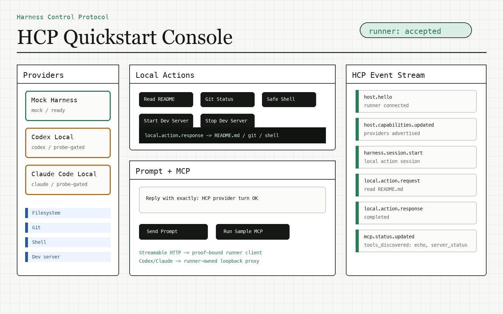

# HCP Quickstart Demo

The quickstart demo is a browser-based control plane that starts a local HCP runner in the same Node process and talks to it over the real HCP WebSocket boundary.

```text
Browser console
  -> demo web control plane
  -> HCP WebSocket message
  -> local runner dispatcher or harness adapter
  -> HCP response/event
  -> browser event stream
```

Run it from the repository root:

```bash
npm run demo:quickstart
```

Open the printed URL, usually `http://127.0.0.1:8790`.



## What It Exercises

- `harness.session.start` for a local mock harness session.
- `local.action.request` and `local.action.response` for README read, Git status, a hardcoded safe Node command, and dev-server start/stop.
- Provider readiness snapshots for mock, Codex, and Claude Code.
- Real `harness.turn.send` to Codex or Claude Code when the local CLI is installed and authenticated.
- Streamable HTTP MCP attachment setup with the sample MCP server.
- Runner-owned loopback MCP proxy setup for Codex and Claude Code sessions when those providers are selected and available.

## Provider Behavior

The demo probes provider readiness through the runner capability snapshot. If `codex` or `claude` is missing or unauthenticated, the UI shows the unavailable state and API calls return a clear error instead of a fake provider response.

The deterministic mock provider is always available and is used for local actions. It can also validate the proof-bound Streamable HTTP MCP client path on machines without Codex or Claude Code.

## Configuration

Environment variables:

| Variable | Default | Purpose |
| --- | --- | --- |
| `HCP_QUICKSTART_HOST` | `127.0.0.1` | Demo HTTP and HCP WebSocket host. |
| `HCP_QUICKSTART_PORT` | `8790` | Initial demo port. If occupied, the demo searches the next few ports. |
| `HCP_QUICKSTART_WORKSPACE` | repository root | Workspace exposed to the local runner. |

The demo does not edit permanent Codex, Claude, MCP, Git, or shell configuration. Provider MCP config is process-local for the CLI turn.

## Current Boundary

Supported in this demo:

- HCP-native local actions.
- Real local Codex and Claude Code turns when the local CLI is ready.
- Streamable HTTP MCP attachments with runner proof headers.
- Runner-owned loopback MCP proxying for Codex and Claude Code sessions.

Not supported:

- Backend-supplied `stdio` MCP attachments.
- Browser-controlled arbitrary executable command/args.
- First-class Cursor adapter or export flow.
